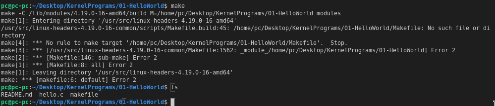
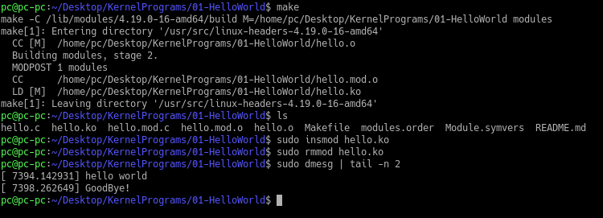

# Dependencies

### The Following packages are required:

* ##### `build-essential`
* ##### `linux-headers` The linux headers for the present kernel version are required, u can directly search for `linux-headers-$(uname -r)`

### Makefile errors
#### NOTE: name the make file as `Makefile`, only this name would work properly, naming it `makefile` (notice the case) results in the below error

### Output
