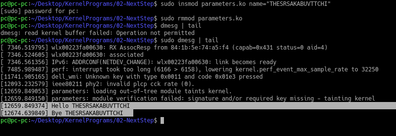

### Output
#### Kernel module is created (`parameters.ko`) and inserted using insmod, removed using rmmod, logged messages can be seen using `sudo dmesg| tail `. We can notice that the name is the same as the one specified in the insmod command
