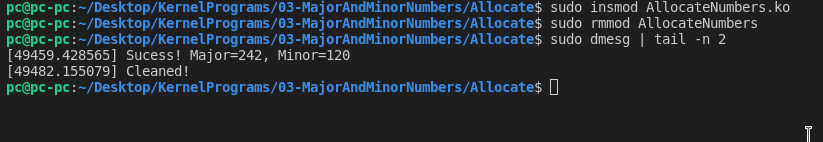
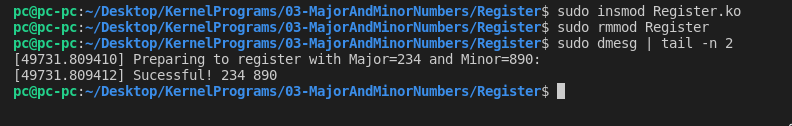

### Functions/Macros to remember:

* `alloc_chrdev_region(dev_t *allocated_device,int starting_minor_number,int number_of_minors,char * Dev_name)`
* `register_chrdev_region(dev_t first_device,int number_of_minors,char * Dev_name)`
* `unregister_chrdev_region(dev_t dev,int num_minor);`
* `MKDEV(int major,int minor)`
* `MAJOR(dev_t dev)`
* `MINOR(dev_t dev)` 

#### Allocate specifies only minor number, range. Register also specifies the Major number (via dev_t struct) in addition to what Allocate specifies.

### Output Allocate

### Output Register
